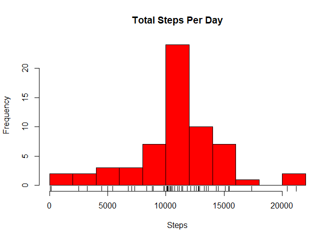
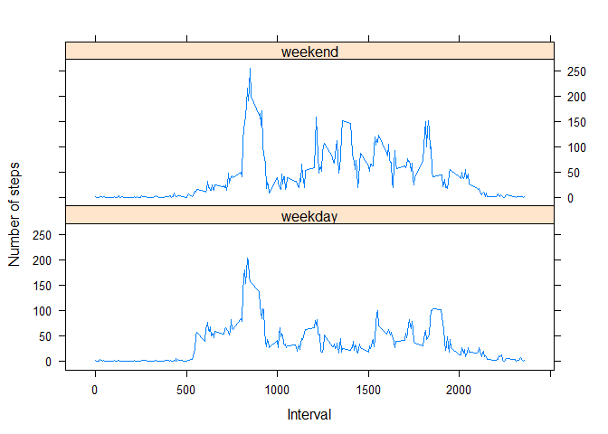

This assignment was accomplished by first forking rdpeng's [repository.](https://github.com/rdpeng/RepData_PeerAssessment1)

The data for the assignment is included in the repository in a file named **activity.zip**

Fork the assignment repository above and clone to your desired working directory.

Built with r version

```
## [1] '3.4.4'
```

## Loading and preprocessing the data

Load the required libraries


```r
library(dplyr)
```

```
## 
## Attaching package: 'dplyr'
```

```
## The following objects are masked from 'package:stats':
## 
##     filter, lag
```

```
## The following objects are masked from 'package:base':
## 
##     intersect, setdiff, setequal, union
```

```r
library(lubridate)
```

```
## 
## Attaching package: 'lubridate'
```

```
## The following object is masked from 'package:base':
## 
##     date
```

```r
library(lattice)
```

Load and Process Data


```r
if (!file.exists("data")) {
        dir.create("data")
        }
unzip("./activity.zip", exdir = "./data")
data <- read.csv("./data/activity.csv")
data[,2] <- as_date(data[,2])
data[,1] <- as.numeric(data[,1])
```

## What is mean total number of steps taken per day?

Calculate the total number of steps taken per day


```r
spd <- data %>% 
        group_by(date) %>%
        summarize(steps = sum(steps)) %>%
        as.data.frame(spd)
spd
```

```
##          date steps
## 1  2012-10-01    NA
## 2  2012-10-02   126
## 3  2012-10-03 11352
## 4  2012-10-04 12116
## 5  2012-10-05 13294
## 6  2012-10-06 15420
## 7  2012-10-07 11015
## 8  2012-10-08    NA
## 9  2012-10-09 12811
## 10 2012-10-10  9900
## 11 2012-10-11 10304
## 12 2012-10-12 17382
## 13 2012-10-13 12426
## 14 2012-10-14 15098
## 15 2012-10-15 10139
## 16 2012-10-16 15084
## 17 2012-10-17 13452
## 18 2012-10-18 10056
## 19 2012-10-19 11829
## 20 2012-10-20 10395
## 21 2012-10-21  8821
## 22 2012-10-22 13460
## 23 2012-10-23  8918
## 24 2012-10-24  8355
## 25 2012-10-25  2492
## 26 2012-10-26  6778
## 27 2012-10-27 10119
## 28 2012-10-28 11458
## 29 2012-10-29  5018
## 30 2012-10-30  9819
## 31 2012-10-31 15414
## 32 2012-11-01    NA
## 33 2012-11-02 10600
## 34 2012-11-03 10571
## 35 2012-11-04    NA
## 36 2012-11-05 10439
## 37 2012-11-06  8334
## 38 2012-11-07 12883
## 39 2012-11-08  3219
## 40 2012-11-09    NA
## 41 2012-11-10    NA
## 42 2012-11-11 12608
## 43 2012-11-12 10765
## 44 2012-11-13  7336
## 45 2012-11-14    NA
## 46 2012-11-15    41
## 47 2012-11-16  5441
## 48 2012-11-17 14339
## 49 2012-11-18 15110
## 50 2012-11-19  8841
## 51 2012-11-20  4472
## 52 2012-11-21 12787
## 53 2012-11-22 20427
## 54 2012-11-23 21194
## 55 2012-11-24 14478
## 56 2012-11-25 11834
## 57 2012-11-26 11162
## 58 2012-11-27 13646
## 59 2012-11-28 10183
## 60 2012-11-29  7047
## 61 2012-11-30    NA
```

Make a histogram of the total number of steps taken each day


```r
hist(spd$steps, main = "Total Steps Per Day", xlab = "Steps", col = "red", breaks = 10)
rug(spd$steps)
```

<!-- -->

Calculate and report the mean and median of the total number of steps taken per day


```r
mean(spd$steps, na.rm = TRUE)
```

```
## [1] 10766.19
```

```r
median(spd$steps, na.rm = TRUE)
```

```
## [1] 10765
```

## What is the average daily activity pattern?

Make a time series plot (i.e. type="l") of the 5-minute interval (x-axis) and the average number of steps taken, averaged across all days (y-axis)


```r
ints <- data %>%
        group_by(interval) %>%
        summarise(steps = mean(steps, na.rm = TRUE)) %>%
        as.data.frame(ints)
plot(x = ints$interval, y = ints$steps, type = "l", xlab = "5-minute Interval of Day",
        ylab = "Average Number of Steps (All Days)", main = 
        "Average Number of Steps per Interval Across All Days")
```

<!-- -->

Which 5-minute interval, on average across all the days in the dataset, contains the maximum number of steps?


```r
filter(ints, steps == max(ints[,2]))
```

```
##   interval    steps
## 1      835 206.1698
```

## Imputing missing values

Calculate and report the total number of missing values in the dataset


```r
sum(is.na(data))
```

```
## [1] 2304
```

Devise a strategy for filling in all of the missing values in the dataset. The strategy does not need to be sophisticated. For example, you could use the mean/median for that day, or the mean for that 5-minute interval, etc.

*I will use the mean steps over all days for the 5-minute interval, which was calculated above in **ints** dataset to fill in missing data.  The following code creates a duplicate dataset of the original data, creates a vector of intervals with missing step data, and indexes a location for the mean steps over all days for a given interval in the ints dataset from above*


```r
data.nafill <- data
steps.na <- data.nafill$interval[is.na(data.nafill$steps)]
index <- sapply(steps.na, function(steps) which(ints$interval == steps))
```

Create a new dataset that is equal to the original dataset but with the missing data filled in.


```r
data.nafill$steps[is.na(data.nafill$steps)] <- ints$steps[index]
```

Make a histogram of the total number of steps taken each day and Calculate and report the mean and median total number of steps taken per day.


```r
spd.nafill <- data.nafill %>% 
        group_by(date) %>%
        summarize(steps = sum(steps)) %>%
        as.data.frame(spd.nafill)
hist(spd.nafill$steps, main = "Total Steps Per Day", xlab = "Steps", col = "red", breaks = 10)
rug(spd.nafill$steps)
```

<!-- -->

```r
mean(spd.nafill$steps)
```

```
## [1] 10766.19
```

```r
median(spd.nafill$steps)
```

```
## [1] 10766.19
```

Do these values differ from the estimates from the first part of the assignment?

**The mean does not differ, but the median does slightly.**

What is the impact of imputing missing data on the estimates of the total daily number of steps?

**The estimate of total daily steps for the missing days makes those days all equal, and increases the frequency of seeing between 10,000 and 10,250 steps durring a day when estimating total stepsper day.  When looking at the histogram with imputed data, you can see that the middle bar is taller than the one in the histogram using the data with missing values.**

## Are there differences in activity patterns between weekdays and weekends?

Create a new factor variable in the dataset with two levels - "weekday" and "weekend" indicating whether a given date is a weekday or weekend day.


```r
weekend <- c(6, 7)
data.wday <- data.nafill 
data.wday$daytype <- factor((wday(data.wday$date) %in% weekend), levels = c(TRUE, FALSE),
        labels = c("weekend", "weekday"))
```

Make a panel plot containing a time series plot (i.e. type = "l") of the 5-minute interval (x-axis) and the average number of steps taken, averaged across all weekday days or weekend days (y-axis).


```r
wewdints <- data.wday %>%
        group_by(daytype, interval) %>%
        summarise(steps = mean(steps)) %>%
        as.data.frame(wewdints)
xyplot(steps ~ interval | daytype, data = wewdints, layout = c(1, 2), type = "l", 
       xlab = "Interval", ylab = "Number of steps", index.cond = list(c(2, 1)))
```

<!-- -->
